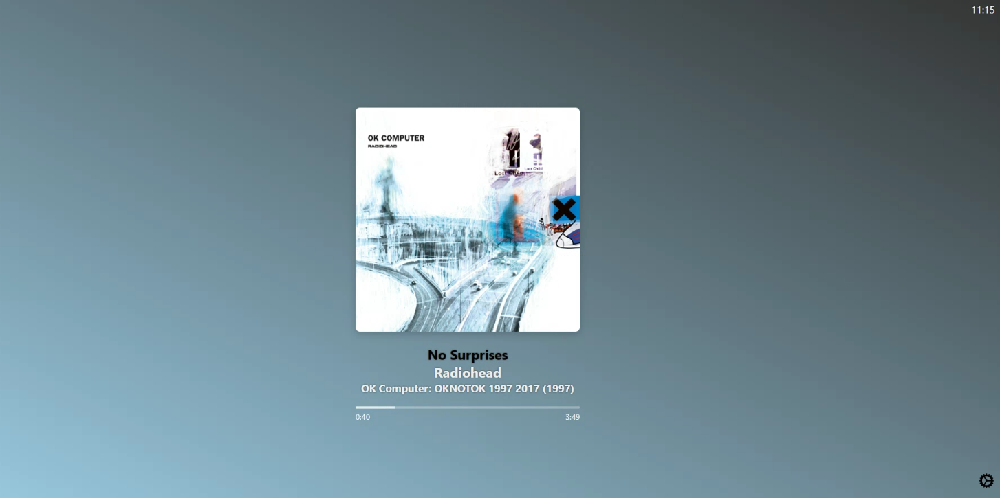

# Plexamp Now Playing Dashboard

A sleek minimal web dashboard that displays the currently playing track on Plexamp with dynamic themes and real-time progress tracking.



## Features

* **Real-Time Now Playing Information**: Shows track title, artist, album, and album art.
* **Smooth Progress Bar**: Visually tracks playback progress without skipping. (I mention this specifically because there was a bug that took up like 1/3rd of development time)
* **Dynamic Themes**:
  + **Light & Dark**: Classic themes for different lighting preferences.
  + **Gradient, Pastel & Glass**: Dynamic backgrounds based on album art colors.
* **Time Format Toggle**: Switch between 24-hour and 12-hour (AM/PM) formats.

## Installation

1. **Clone the Repository**
2. **Navigate to the Project Directory**
3. **Open `index.html` in Your Browser**
   - Warning: If your server doesn't support HTTPS/Only supports HTTPS make sure the toggle in the settings modal reflects this. Otherwise it won't pull data.

## Configuration

1. **Open the Settings Modal**
   - Click the **Settings** button on the dashboard.

2. **Enter Plex Server Details**
   - **Plex Server IP**: Your Plex server's IP address.
   - **Plex Token**: Your Plex server's access token.

     - Find your plex token [here](https://support.plex.tv/articles/204059436-finding-an-authentication-token-x-plex-token/)

3. **Select Theme and Time Format**
   - Choose your preferred theme from the dropdown.
   - Select the desired time format (24-hour is default).

4. **Save Settings**
   - Click **Save Settings** to apply your preferences.

## Usage

* **View Now Playing**: The dashboard will automatically display the current track playing on Plexamp.
* **Monitor Progress**: The progress bar updates in real-time to reflect playback.
* **Change Settings**: Reopen the settings modal anytime to update your Plex server details or change themes and time formats.

## Dependencies

* **[Vibrant.js](https://github.com/Vibrant-Colors/node-vibrant)**: Used for extracting prominent colors from album art for dynamic theming.

## Running with Docker

To build and run the Docker container for this application, follow these steps:
1. **Clone the Repository**
   

```sh
   git clone https://github.com/claesbert/PlexampStatusPage.git
   cd PlexampStatusPage
   ```

2. **Build the Docker Image**
   

```sh
   docker build -t plexamp-status-page -f docker/Dockerfile .
   ```

3. **Run the Docker Container**
   

```sh
   docker run -d -p 8080:80 --name plexamp-status-page plexamp-status-page
   ```

## Running with Docker Compose

To run the application using Docker Compose, follow these steps:
1. **Clone the Repository**
   

```sh
   git clone https://github.com/claesbert/PlexampStatusPage.git
   cd PlexampStatusPage
   ```

2. **Create a `.env` file** with the following content:
   

```env
   PLEX_IP=your_plex_ip
   PLEX_TOKEN=your_plex_token
   ```

3. **Start the Application**
   

```sh
   docker compose up -d

   #For older docker versions use the following command
   #docker-compose up -d
   ```

4. **Stop the Application**
   

```sh
   docker compose down
   ```

## License

Creative Commons Zero v1.0 Universal
_Basiclly: Do whatever the fuck you want with this, we waive copyright, it is part of the public domain_

_I'll admit idk what it means to use a library like vibrant.js in a CC0 codebase. Like obviously it is covered by its own license._

## Known (big) issues

* Currently pausing behavior is weird/broken. (Feel free to fix it so I don't have to <3)

## Originally made by these idiots

[Bert Claes](https://github.com/claesbert/) & [Marnick De Grave](https://github.com/protobear)
